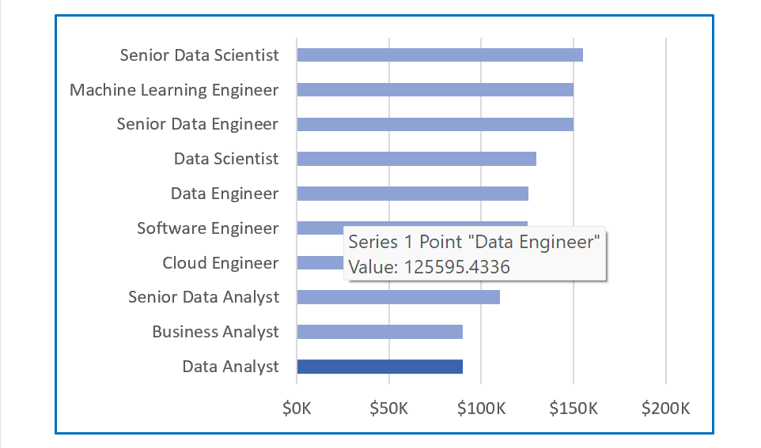
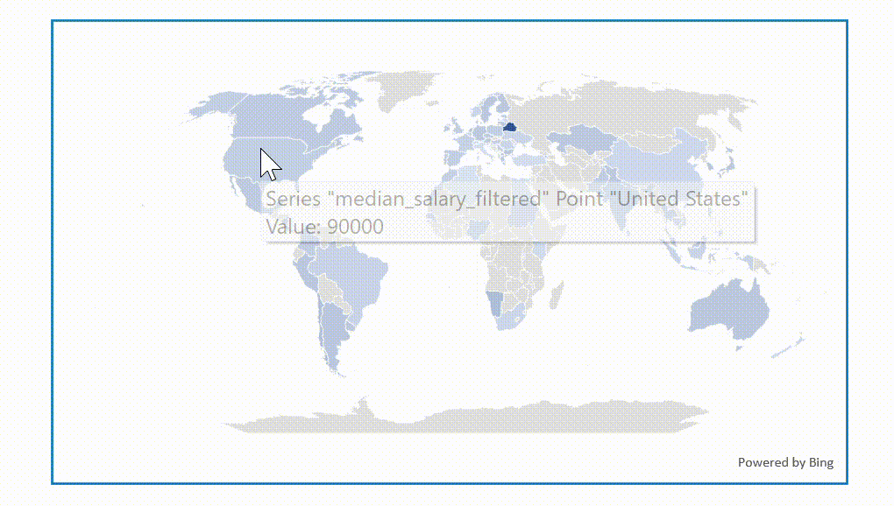
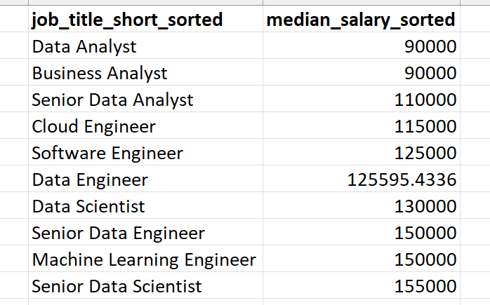
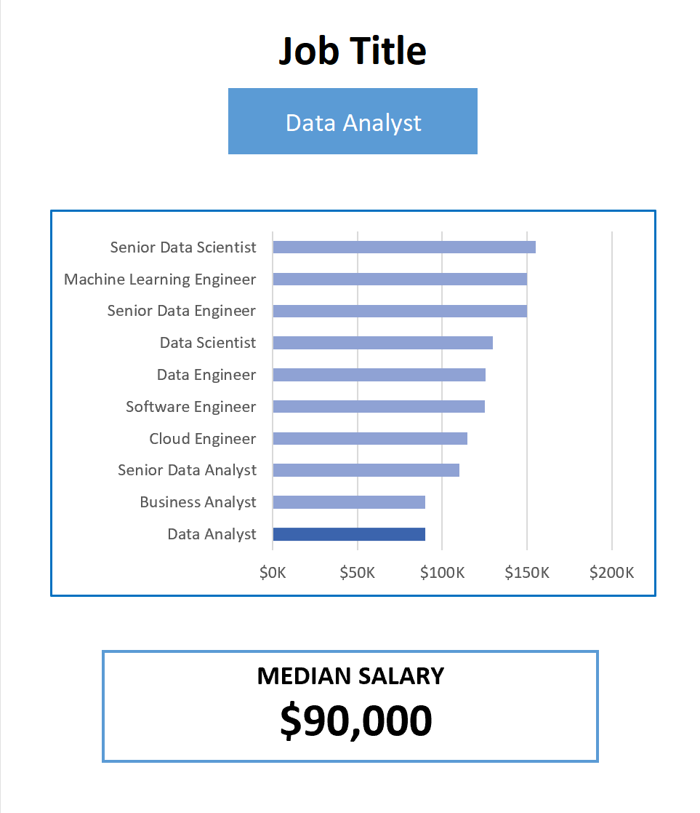
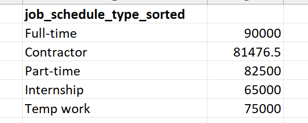
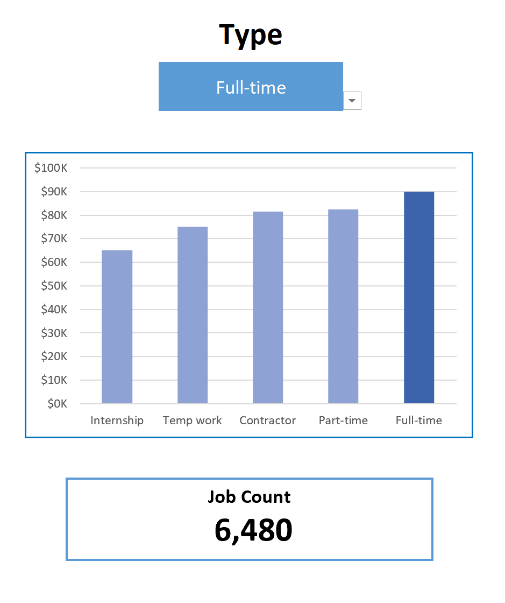
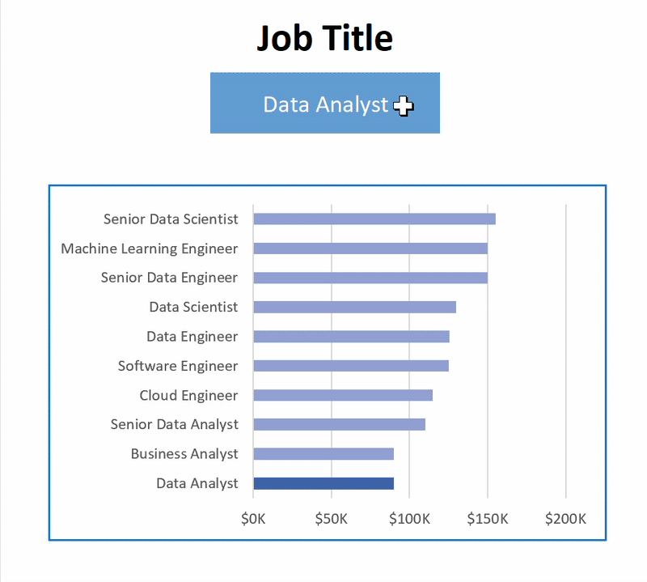

# Interactive Excel Data Science Salary Dashboard


## Introduction

This data jobs salary dashboard was created to help job seekers investigate salaries for their desired jobs and ensure they are being adequately compensated.

The data is from Luke Barousse's Excel course. The data contains detailed information on job titles, salaries, locations, and essential skills that are presented here.

### Dashboard File
My final dashboard is in [Excel Dashboard](excel_dashboard.xlsx)

### Excel Skills Used

The following Excel skills were utilized for analysis:
- **📉 Charts**
- **🧮 Formulas and Functions**
- **❎ Data Validation**

### Data Jobs Dataset

The dataset used for this project contains real-world data science job information from 2023. It includes detailed information on:

- **👨‍💼 Job titles**
- **💰 Salaries**
- **📍 Locations**
- **🛠️ Skills**

## Dashboard Build

### 📉 Charts

#### 📊 Data Science Job Salaries - Bar Chart



- **Excel Features:** Utilized bar chart feature (with formatted salary values) and optimized layout for clarity.
- **Design Choice:** Horizontal bar chart for visual comparison of median salaries.
- **Data Organization:** Sorted job titles by descending salary for improved readability.
- **Insights Gained:** This enables quick identification of salary trends, noting that Senior roles and Engineers are higher-paying than Analyst roles.

#### 🗺️ Country Median Salaries - Map Chart



- **Excel Features:** Utilized Excel's map chart feature to plot median salaries globally.
- **Design Choice:** Color-coded map to visually differentiate salary levels across regions.
- **Data Representation:** Plotted median salary for each country with available data.
- **Visual Enhancement:** Improved readability and immediate understanding of geographic salary trends.
- **Insights Gained:** Enables quick grasp of global salary disparities and highlights high/low salary regions.

### 🧮 Formulas and Functions

#### 💰 Median Salaries by Job Titles

```
=MEDIAN(
IF(
    (jobs[job_title_short]=A2)*
    (jobs[job_country]=country)*
    (ISNUMBER(SEARCH(type,jobs[job_schedule_type])))*
    (jobs[salary_year_avg]<>0),
    jobs[salary_year_avg]
)
)
```

- **Multi-Criteria Filtering:** Checks job title, country, schedule type, and excludes blank salaries.
- **Array Formula:** Utilizes `MEDIAN()` function with nested `IF()` statement to analyze an array.
- **Tailored Insights:** Provides specific salary information for job titles, regions, and schedule types.
- **Formula Purpose:** This formula populates the table below, returning the median salary based on job title, country, and type specified.

🍽️ Background Table



📉 Dashboard Implementation




#### ⏰ Count of Job Schedule Type

```
=FILTER(J2#,(NOT(ISNUMBER(SEARCH("and",J2#))+ISNUMBER(SEARCH(",",J2#))))*(J2#<>0))
```

- **Unique List Generation:** This Excel formula below employs the `FILTER()` function to exclude entries containing "and" or commas, and omit zero values.
- **Formula Purpose:** This formula populates the table below, which gives us a list of unique job schedule types.

🍽️ Background Table



📉 Dashboard Implementation




### Data Validation

#### 🔍 Filtered List

- **Enhanced Data Validation:** Implementing the filtered list as a data validation rule under the `Job Title`, `Country`, and `Type` option in the Data tab ensures:
    - 🎯 User input is restricted to predefined, validated schedule types
    - 🚫 Incorrect or inconsistent entries are prevented
    - 👥 Overall usability of the dashboard is enhanced
 



## Conclusion

I created this dashboard to showcase insights into salary trends across various data-related job titles. 
This dashboard allows users to make informed decisions about their career paths.
Exploring the functionalities to understand how location and job type influence salaries.
